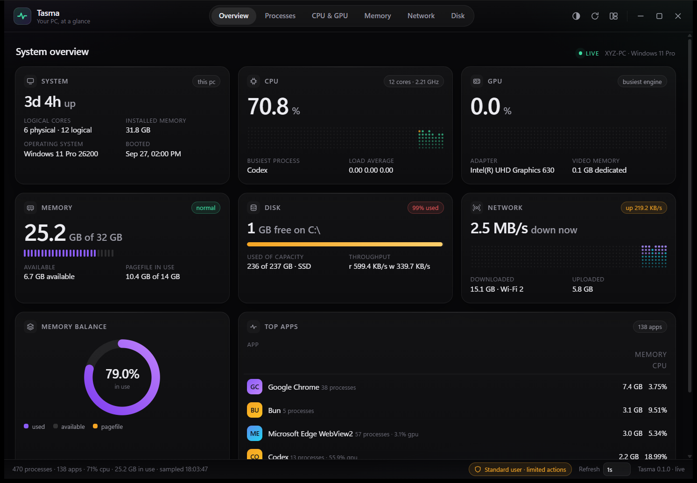
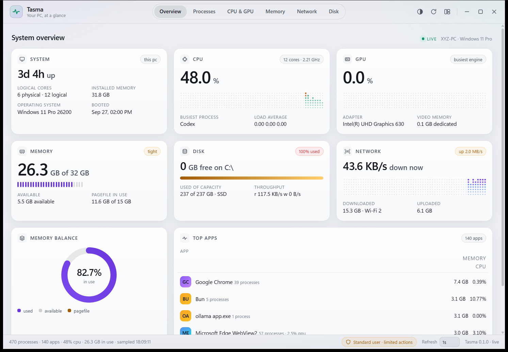

<div align="center">

# Tasma

**A fast, focused system monitor and task manager.**

Live CPU, GPU, memory, disk and network telemetry, plus a real process
workbench. Rust and Tauri, no web server, no telemetry, no account.

[](https://github.com/temidayoxyz/tasma/actions/workflows/ci.yml)
[](https://github.com/temidayoxyz/tasma/releases/latest)
[](LICENSE)

[Download](https://github.com/temidayoxyz/tasma/releases/latest) &middot;
[Releases](https://github.com/temidayoxyz/tasma/releases) &middot;
[Changelog](CHANGELOG.md)

</div>

---

## Why Tasma

Task Manager is fine at answering questions and bad at answering them *quickly*.
It opens slowly, redraws everything on every tick, and treats the interesting
numbers as an afterthought.

Tasma samples continuously, keeps its own history, and redraws only what changed.
The charts are dot-matrix traces rather than filled areas, so a 60-sample window
reads as texture instead of a blob. One idea per card. The colour system stays out
of the way until you ask for it.

## Screens

| Overview (dark) | Processes (light) |
| --- | --- |
|  |  |

## Features

**Sampling**

- CPU total, per-logical-processor, clock, load average, and per-process share
- GPU adapter load and per-engine utilisation (DXGI on Windows)
- Physical memory, pagefile, and the honest caveat that summing working sets
  double counts shared pages
- Per-adapter network throughput, addresses, MAC, totals and packet counts
- Every disk volume with live I/O and a per-process leaderboard

**Process workbench**

- Sort by name, PID, CPU, memory, disk, GPU, threads or status
- Filter across friendly name, executable, PID, path and user
- End task (closes windows politely), force terminate, suspend and resume
- Priority, efficiency mode, open file location, copy PID or path
- Detail drawer with the command line, working directory and live counters
- Virtualised table, so 800 processes scroll like 80

**Interface**

- **System-aware light and dark themes.** Starts on whatever your OS is doing and
  follows it live until you choose for yourself; one button cycles
  system ? light ? dark and remembers.
- **Compact widget mode** � a narrow always-on-top strip, with a view picker for when
  the tab bar no longer fits.
- Elevation prompt when an action needs administrator rights
- Adjustable refresh rate from 0.5s to paused
- Keyboard shortcuts: `Ctrl`+`1`�`6` for views, `Ctrl`+`F` to filter, `F5` to sample
- Polling stops entirely when the window is hidden

## Install

Grab a build for your platform from the
[releases page](https://github.com/temidayoxyz/tasma/releases/latest).

| Platform | Architectures | Formats |
| --- | --- | --- |
| Windows | x64, ARM64 | `.exe` (NSIS installer), `.msi` |
| macOS | Apple Silicon, Intel | `.dmg` |
| Linux | x64, ARM64 | `.AppImage`, `.deb` |

The NSIS installer defaults to a per-user install, so it needs no administrator
rights. On Linux, `chmod +x` the AppImage and run it; on macOS, drag Tasma to
Applications.

## Building from source

You need a [Rust toolchain](https://rustup.rs) (1.77.2 or newer) and Node 20+.

```bash
git clone https://github.com/temidayoxyz/tasma.git
cd tasma
npm install
npm start          # run it
npm run build      # produce an installer for the current platform
```

Linux also needs the WebKitGTK development packages:

```bash
sudo apt install libwebkit2gtk-4.1-dev libappindicator3-dev librsvg2-dev patchelf
```

### Tests

```bash
cargo test --manifest-path src-tauri/Cargo.toml   # sampler and platform layer
node tools/ui-selftest.mjs                       # frontend units, no browser needed
cargo run --manifest-path src-tauri/Cargo.toml -- --probe   # live telemetry dump
```

`--probe` prints a real snapshot from the running machine, which is the quickest way
to check that a platform integration is working.

## How it is put together

```
dist/          the frontend: plain ES modules, no build step, no framework
  app.js       bootstrap, polling loop, chrome
  views.js     the data views
  processes.js the process workbench
  table.js     virtualised table, sorting, grouping
  charts.js    canvas widgets
  theme.js     system-aware light/dark
  menu.js      the shared context menu
src-tauri/     the Rust side
  metrics.rs   the sampler and its history
  platform/    OS integration, with stubs so other targets still build
  commands.rs  the IPC surface
tools/         icon generation, screenshots, UI self-test
```

Two decisions worth knowing about:

**No frontend build step.** The UI is ES modules loaded straight from `dist/`. You
can open `dist/index.html` in a browser and it runs against deterministic mock data,
which is how the frontend is tested without a WebView.

**Colours are tokens, not literals.** Every surface is a CSS custom property, so the
light theme is one block of overrides rather than a second stylesheet. The charts
read their colours from the same tokens and repaint when the theme changes.

## Platform support

Tasma's process control, GPU telemetry and window handling are implemented for
Windows. The sampler and the whole UI build and run everywhere � on macOS and Linux
the mutating actions explain that they are Windows-only rather than failing silently.

## Contributing

Phases are small and one concern each. `npm test` equivalents above should pass
before you open a pull request. If you change the UI, run the self-test; it is fast
and catches most regressions.

## License

[MIT](LICENSE)
